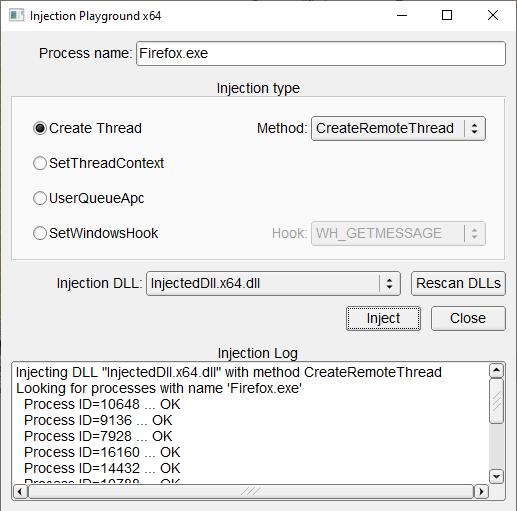

# InjectionPlayground

## Description

This project contains a collection of several DLL injection mthods:
* Creating remote thread in a target process (**CreateRemoteThread**, **RtlCreateUserThread**, **NtCreateThreadEx**)
* Injection of shellcode with **SetThreadContext**
* Injection with **QueueUserApc**
* Injection by setting windows hooks with **SetWindowsHookEx** (not as effective and universal, but it is added for reference).

The code is capable of injection into both x64 and x86 processes (platform-specific injection DLLs are also generated).



## Instruments

* Visual Studio 2019
* C++17

## Dependencies

The following dependencies are included in the **3rdparty** subdirectory:

* [WIL](https://github.com/microsoft/wil) - RAII wrappers for WinAPI entities
* [FLTK](http://www.fltk.org) - GUI library

## Project structure

Project consists of the following parts:
* **InjectionPlayground** &ndash; console utility that inject a DLL into all processes with specified executable names.
* **InjectionPlaygroundGui** &ndash; same as above but with GUI.
* **InjectedDll** &ndash; project with DLL payload that is injected into a process. It shows a message box with information about process and thread.
* **WindowsHookDll** &ndash; DLL payload for SetWindowsHook method. The difference is an exported function that is needed for setting a hook for window events.
* Static libraries
  * **InjectedPayloadLib** &ndash; static library for code that is common between InjectedDll and WindowsHookDll. Logging stuff and messaging functions.
  * **InjectionLib** &ndash; static library with actual implementations of injections. Used by InjectionPlayground
  * **UtilsLib** &ndash; Universal utils library: logging, process utils, assembly wrapper for shell code data.

## Usage

Usage of a console utility:

```
InjectionPlayground <process name> [injection method id] [type of hook for SetWindowsHook]
```

Injection methods:
* 1 - **CreateRemoteThread** (default)
* 2 - **RtlCreateUserThread**
* 3 - **NtCreateThreadEx**
* 4 - **SetThreadContext**
* 5 - **QueueUserApc**
* 6 - **SetWindowsHook**

Message types for **SetWindowsHook** method (refer to the [SetWindowsHookEx documentation](https://learn.microsoft.com/en-us/windows/win32/api/winuser/nf-winuser-setwindowshookexw#parameters) for exact list):
* **WH_CALLWNDPROC**
* **WH_CALLWNDPROCRET**
* **WH_CBT**
* **WH_DEBUG**
* **WH_FOREGROUNDIDLE**
* **WH_GETMESSAGE** - default value if no value is specified here
* **WH_JOURNALPLAYBACK**
* **WH_JOURNALRECORD**
* **WH_KEYBOARD**
* **WH_KEYBOARD_LL**
* **WH_MOUSE**
* **WH_MOUSE_LL**
* **WH_MSGFILTER**
* **WH_SHELL**
* **WH_SYSMSGFILTER**

## TODO

* [ ] InjectDllByOEP - injection loader function is contained in the injected DLL itself. May be useful for dealing with complex loading process

Really don't know whether the following is worth adding:
* [ ] SetThreadContext & LoadLibraryExW injections. Requires updated shellcode
* [ ] Reflective injection
* [ ] Inject from driver in kernel space


## Links

Used code from:
* [InjectCollection](https://github.com/AzureGreen/InjectCollection/) by [AzureGreen on GitHub](https://github.com/AzureGreen) &ndash; Some helpful utilities
* [3 Effective DLL Injection Techniques for Setting API Hooks](https://www.apriorit.com/dev-blog/679-windows-dll-injection-for-api-hooks)

Related code:
* [ReflectiveDLLInjection](https://github.com/stephenfewer/ReflectiveDLLInjection) by [stephenfewer](https://github.com/stephenfewer) &ndash; Another injection technique
* [injection](https://github.com/odzhan/injection) by [odzhan](https://github.com/odzhan/injection) &ndash; Collection of injection methods
